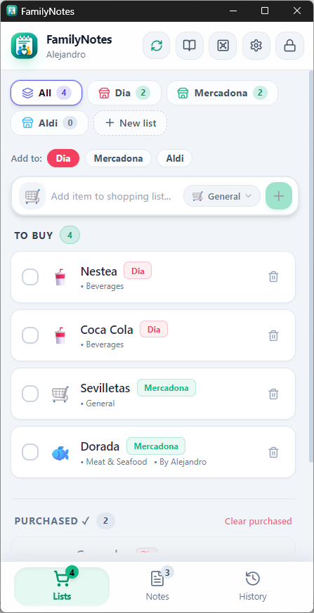
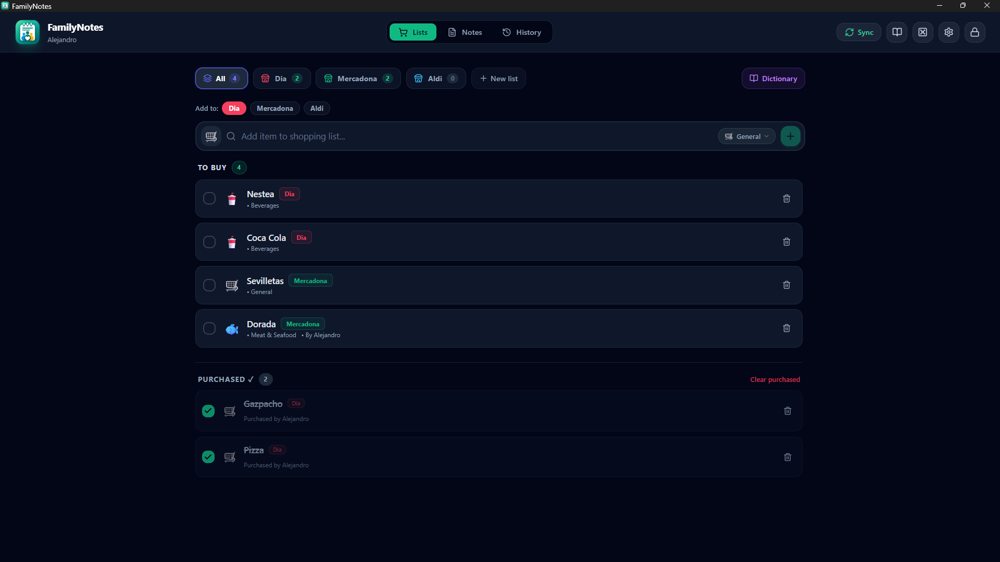
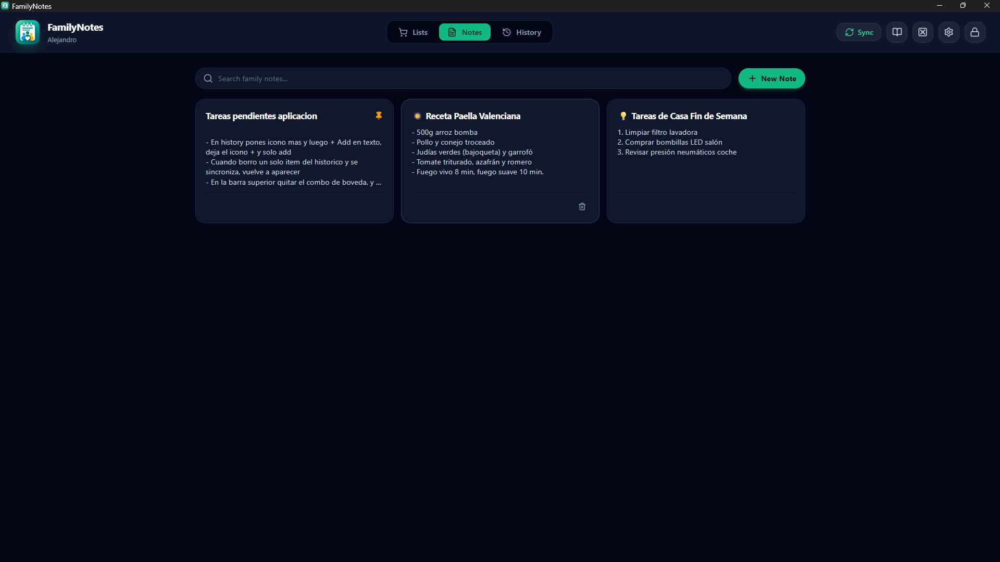
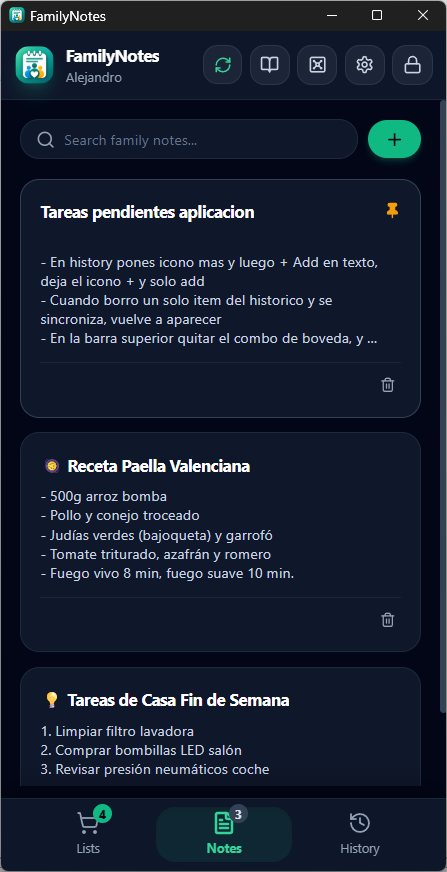
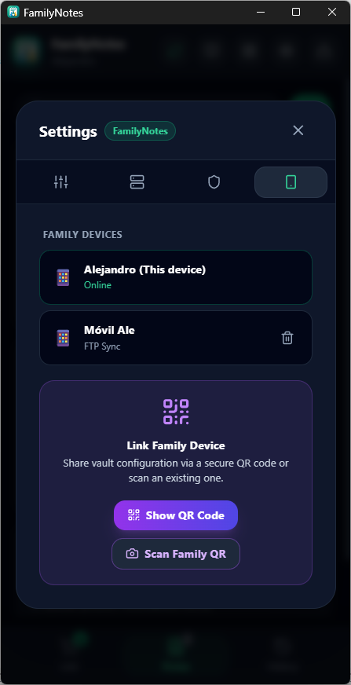
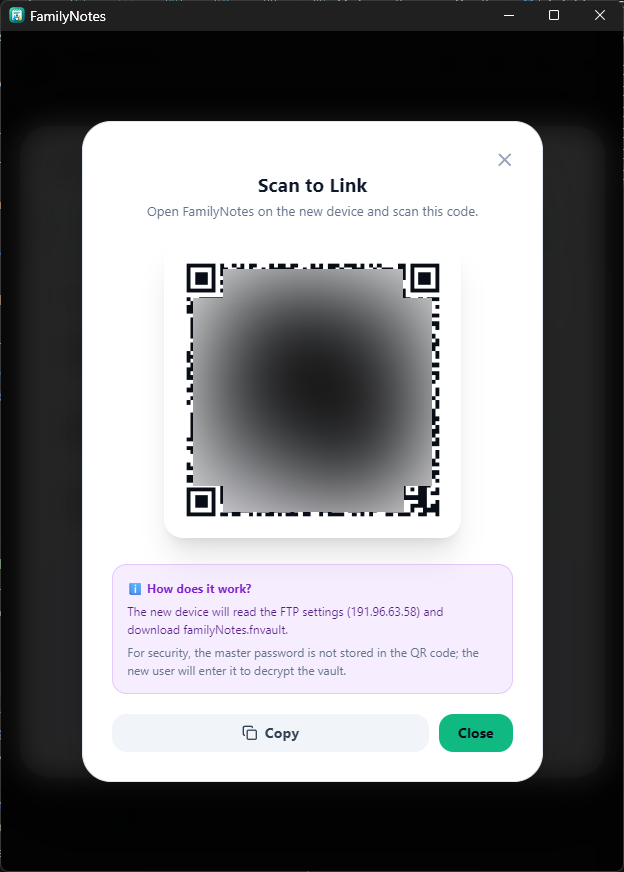

# FamilyNotes — User Manual & Operating Guide

Welcome to the **FamilyNotes User Manual**. This comprehensive guide walks you through every feature, workflow, and security mechanism of FamilyNotes across **Desktop** (Windows, macOS, Linux) and **Mobile** (Android, iOS).

---

## Table of Contents

1. [Introduction & Zero-Knowledge Security](#1-introduction--zero-knowledge-security)
2. [Interface & Navigation Overview](#2-interface--navigation-overview)
3. [Smart Shopping Lists](#3-smart-shopping-lists)
   - [Store Tabs & List Management](#store-tabs--list-management)
   - [The Consolidated "All" Tab](#the-consolidated-all-tab)
   - [Adding Products & Autocomplete](#adding-products--autocomplete)
   - [Purchasing & Clearing Items](#purchasing--clearing-items)
   - [Tab Reordering (Drag-and-Drop & Touch Long-Press)](#tab-reordering-drag-and-drop--touch-long-press)
   - [Archiving Lists](#archiving-lists)
4. [Encrypted Family Notes](#4-encrypted-family-notes)
   - [Creating & Editing Notes](#creating--editing-notes)
   - [Pinning Important Notes](#pinning-important-notes)
   - [Real-Time Search](#real-time-search)
5. [Purchase History & Smart Suggestions](#5-purchase-history--smart-suggestions)
6. [Family Devices Management](#6-family-devices-management)
   - [Viewing Connected Devices](#viewing-connected-devices)
   - [Remote Device Revocation](#remote-device-revocation)
7. [Instant QR Code Device Pairing](#7-instant-qr-code-device-pairing)
   - [Why the Master Password is Never in the QR](#why-the-master-password-is-never-in-the-qr)
   - [Step-by-Step Pairing Workflow](#step-by-step-pairing-workflow)
8. [Private Cloud Sync (FTP / FTPS)](#8-private-cloud-sync-ftp--ftps)
9. [Preferences, Themes & Internationalization](#9-preferences-themes--internationalization)

---

## 1. Introduction & Zero-Knowledge Security

**FamilyNotes** is an encrypted household organizer designed to keep your family's shopping lists, tasks, and private notes completely synchronized without surrendering your personal data to proprietary cloud services.

### Core Cryptographic Principles
- **Argon2id Key Derivation**: Your master password is never stored anywhere on disk or in the cloud. It is derived into an encryption key using the memory-hard **Argon2id** algorithm with a dedicated 16-byte cryptographic salt.
- **Authenticated Encryption (AEAD)**: Vault data is protected by **XChaCha20-Poly1305** using unique 24-byte nonces. Any tampering, corruption, or eavesdropping is mathematically detected and rejected.
- **Zero-Knowledge Cloud**: Synchronization happens directly between your own devices and your private FTP/FTPS server. The server only ever sees encrypted `.fnvault` blobs.

---

## 2. Interface & Navigation Overview

The FamilyNotes interface is designed to adapt seamlessly between desktop widescreen layouts and compact touch devices:

- **Header Bar**:
  - **App Brand & Device Name**: Shows the current active device identity (e.g. *Alejandro*).
  - **Sync Indicator (🔄)**: Displays synchronization status (*Synced*, *Syncing...*, or *Sync Error*) and triggers immediate sync on click.
  - **Dictionary (📖)**: Opens the product catalog editor.
  - **Vault Manager (🗄️)**: Allows switching between multiple isolated vaults.
  - **Settings (⚙️)**: Configures language, theme, device identity, FTP credentials, and security options.
  - **Lock Button (🔒)**: Locks the vault immediately, purging decryption keys from device RAM.
- **Main Navigation**: Switch between **Lists** (🛒), **Notes** (📝), and **History** (⏱️). On desktop, this appears in the top navigation bar; on mobile, it anchors to the bottom for ergonomic thumb navigation.

---

## 3. Smart Shopping Lists

  
   
  <em>Figure 1: Shopping Lists view on mobile (Light Theme), showing the consolidated "All" tab, store badges, and categorized products.</em>

### Store Tabs & List Management
You can organize shopping lists by specific stores or merchants (e.g. **Dia**, **Mercadona**, **Aldi**, **Pharmacy**, **Bakery**):
- Each list can be assigned a custom emoji icon and accent color.
- Badges on each tab clearly show the number of pending products to purchase in that store.
- Tap the **"+ New list"** button to create a new shopping destination anytime.

### The Consolidated "All" Tab
The first tab is **"All"** (Todas). It aggregates pending items across every active list:
- **Store Badges**: Each item displayed in the "All" view shows a colored badge indicating which store it belongs to (e.g., `Dia`, `Mercadona`).
- **Destination Selector**: When the "All" tab is active, a quick destination selector (`Add to: [Dia] [Mercadona] [Aldi]`) appears directly above the input bar, allowing you to add products to any store without switching tabs.
- The "All" tab is fixed at the start of the tab row for instant access.

  
   
  <em>Figure 2: Desktop widescreen view (Dark Mode), displaying "To Buy" products and the "Purchased" history section.</em>

### Adding Products & Autocomplete
1. Click or tap into the **"Add item to shopping list..."** field.
2. Start typing the name of any item (e.g., *Nestea*, *Coca Cola*, *Dorada*).
3. The integrated dictionary suggests products with automatic emoji icons and category categorization (*Beverages*, *Meat & Seafood*, *Bakery*, *Dairy*, etc.).
4. Press **Enter** or tap the **"+"** button to add the item.

### Purchasing & Clearing Items
- **Mark as Purchased**: Tap or click the round checkbox next to any product. It will move down to the **"PURCHASED"** section with a timestamp and attribution of who bought it.
- **Clear Purchased**: Tap **"Clear purchased"** to dismiss completed items and record them into the household consumption history for smart replenishment suggestions.

### Tab Reordering (Drag-and-Drop & Touch Long-Press)
You can reorganize your store tabs in any preferred order (for instance, ordering them by the route you take during your weekly shopping run):
- **On Desktop**: Click and drag any store tab horizontally to drop it into a new position.
- **On Mobile**: Press and hold (long-press) a tab. Your device will provide a gentle haptic vibration feedback, allowing you to slide the tab to its new slot.

### Archiving Lists
When a seasonal list (such as *Christmas Dinner* or *Summer Camping*) is no longer actively needed, you can archive it:
- Archiving preserves all products in a read-only state without permanently deleting them.
- Access archived lists at any time via the **"Archived lists"** button to restore or review them.

---

## 4. Encrypted Family Notes

FamilyNotes includes a dedicated, encrypted notes repository for recipes, checklists, repair manuals, or private household credentials.

  
   
  <em>Figure 3: Family Notes desktop grid (Dark Mode) with pinned cards, recipe notes, and quick search.</em>

### Creating & Editing Notes
1. Navigate to the **Notes** tab.
2. Click **"+ New Note"**.
3. Enter a title and write your content. You can write formatted multi-line text, bullet points, checklists, and instructions.
4. Changes are encrypted and saved locally in real-time.

  
   
  <em>Figure 4: Mobile notes view (Dark Mode), displaying responsive single-column cards and quick note creation.</em>

### Pinning Important Notes
Keep essential notes right at the top of your screen:
- Click the **Pin (📌)** icon on any note card.
- Pinned notes automatically position themselves at the beginning of the notes grid with a prominent golden badge.

### Real-Time Search
Use the top search bar (**"Search family notes..."**) to filter notes instantly by words contained in either their title or body.

---

## 5. Purchase History & Smart Suggestions

Every time items are checked off and cleared, FamilyNotes records the event in an encrypted local history log:
- **Consumption Habits**: The app calculates how frequently products are bought.
- **Smart Replenishment Carousel**: Items that are nearing their typical repurchase window appear in a suggestions carousel in the shopping view for single-click addition.
- **Permanent Deletion (Tombstone Tracking)**: If you remove an item from your history, FamilyNotes writes a cryptographic tombstone marker so that subsequent synchronizations with other devices never resurrect the deleted item.

---

## 6. Family Devices Management

  
   
  <em>Figure 5: Family Devices tab in Settings, showing registered devices, online status, and remote revocation controls.</em>

### Viewing Connected Devices
In **Settings (⚙️) > Family Devices**, you can inspect all hardware registered with access to the vault:
- **This Device**: Highlights your current device (e.g. *Alejandro (This device)*) and displays its active *Online* status.
- **Remote Devices**: Lists other family devices (e.g. *Móvil Ale*) with their connection type (*FTP Sync*).

### Remote Device Revocation
If a family smartphone is lost, stolen, or decommissioned:
1. Open the **Family Devices** tab on any authorized device.
2. Tap the **Trash (🗑️)** icon next to the device to revoke.
3. Confirm the revocation dialog.
4. On the next synchronization, the revoked device is immediately ejected from the family vault and locked out. It will require entering the master password to regain access.

---

## 7. Instant QR Code Device Pairing

Connecting a new family phone or tablet takes just seconds using the built-in secure QR pairing system.

  
   
  <em>Figure 6: "Scan to Link" QR Code modal with connection parameters and zero-knowledge security disclaimer.</em>

### Why the Master Password is Never in the QR
> [!IMPORTANT]
> **Strict Zero-Knowledge Guarantee**: The QR code contains **only** the FTP server connection parameters and vault file name. For security, the **master password is NEVER encoded into the QR code**.
> When the new user scans the code, the application downloads the encrypted vault file from your FTP server, and the user must type the master password to unlock and decrypt it locally.

### Step-by-Step Pairing Workflow

#### On the Primary (Existing) Device:
1. Open **Settings (⚙️)** and select the **Family Devices** tab.
2. Under the **Link Family Device** card, tap **"Show QR Code"**.
3. A modal displaying the **Scan to Link** QR code will appear (Figure 6).

#### On the New Device:
1. Launch FamilyNotes on the new smartphone or computer.
2. On the welcome screen, choose **"Scan Family QR"** (or use the camera button).
3. Point your camera at the QR code on the primary screen.
   - *Alternative 1*: If your camera is unavailable, tap **"Upload QR image / photo"** to select a screenshot.
   - *Alternative 2*: Tap **"Paste"** if you copied the link string from the clipboard.
4. Once scanned, FamilyNotes connects to your private FTP server and downloads the vault file.
5. Enter your vault's **Master Password** to complete setup and start collaborating.

---

## 8. Private Cloud Sync (FTP / FTPS)

FamilyNotes uses a non-proprietary FTP backend so you can host your data anywhere:
- **Supported Protocols**: Standard **FTP** (Port 21) and secure **FTPS** (Explicit TLS).
- **Background Synchronization**:
  - Automatically triggers after a few seconds of inactivity following edits.
  - Automatically syncs when the window regains focus.
  - Automatically syncs upon application launch.
- **Manual Sync**: Tap the **Sync (🔄)** icon in the top header anytime for an immediate bidirectional refresh.
- **Conflict-Free Merging**: If two family members check off items simultaneously while offline, both sets of changes are safely merged without data loss.

---

## 9. Preferences, Themes & Internationalization

In **Settings (⚙️) > General**, customize your daily experience:

- **Theme**:
  - **🌐 System**: Follows your operating system's light or dark mode.
  - **☀️ Light**: Clean, high-contrast light theme.
  - **🌙 Dark**: Elegant deep dark mode optimized for OLED screens and nighttime shopping.
- **Language**:
  - **🌐 System**: Automatically detects your device language.
  - **🇪🇸 Español**: Full Spanish localization.
  - **🇬🇧 English**: Full English localization.
- **Device Name**: Personalize the name shown to family members (e.g. *Dad's Phone*, *Kitchen Tablet*).
- **Master Password Update**: Safely re-encrypt your entire vault with a new master password from the **Security** tab.

---

*FamilyNotes is open source software licensed under the **MIT License**. Enjoy complete privacy and effortless household coordination!*
