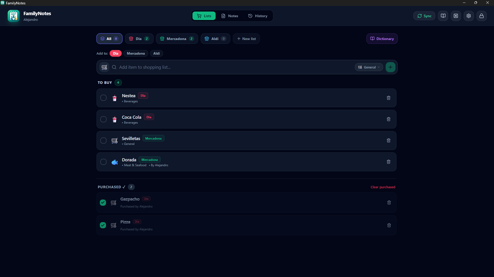

<p align="center">
  
</p>

<h1 align="center">FamilyNotes</h1>

<p align="center">
  <strong>End-to-end encrypted family shopping lists and secure shared notes.</strong><br>
  <em>Mobile-first, zero-knowledge architecture built with Tauri v2 (Rust + React).</em>
</p>

<p align="center">
  
  
  
  
  
  
  
</p>

<p align="center">
  
</p>

<p align="center">
  📖 <strong><a href="MANUAL.md">Click here to view the Complete User Manual & Operating Guide</a></strong> 📖
</p>

---

## 📱 What is FamilyNotes?

**FamilyNotes** is a cross-platform application (Android, Windows, Linux, macOS, iOS) built for families and households to manage shopping lists and notes with speed, ease, and **complete privacy**. Every piece of information is encrypted locally on your device with military-grade cryptography before being stored or synchronized.

---

## 🚀 Key Features

### 🛒 Smart Shopping Lists
- **Multi-Store Management**: Organize shopping lists by store or merchant (e.g. Supermarket, Pharmacy, Bakery, Hardware) with custom emoji icons and colors.
- **Consolidated "All" Tab**: A fixed first tab that sums all pending items across every active list, displaying store badges for each product and a quick destination selector when adding new items.
- **Touch & Mouse Tab Reordering**: Long-press tabs on mobile devices (with haptic vibration feedback) or drag-and-drop on desktop to rearrange store lists to your liking.
- **Smart Replenishment Reminders**: Intelligent carousel suggestions for frequently purchased products based on consumption habits.
- **Product Dictionary & Categories**: Fast autocomplete with emojis and localized categories, backed by a built-in catalog and a custom family dictionary editor.
- **Archiving System**: Archive seasonal or completed lists into a dedicated read-only section, with the ability to unarchive or permanently delete them.

### 📋 Family Tasks & Kanban Boards
- **Dual Visualizations**: Switch seamlessly between an interactive **Kanban Board** with responsive columns and a **Structured List / Table** view with sorting and filters.
- **Customizable Columns & Statuses**: Task statuses define the Kanban columns. Add new statuses, edit names and colors from a rich palette, mark final/completed columns, reorder columns, and safely delete them with automatic task reassignment to prevent orphaned data.
- **HTML5 Drag-and-Drop & Note Conversion**: Drag cards smoothly between columns or reorder tasks within a column. Use the "Notes" drawer to drag any vault note directly into a Kanban column to instantly convert it into a task.
- **Tag Filtering**: Filter tasks by tag via the toolbar dropdown or by clicking on `#tag` chips directly on Kanban cards or table rows, complete with an active filter badge and clear button.
- **In-Place Quick Editing & Mobile Nudge**: Toggle completion status, change priorities, or nudge tasks left and right between columns directly on cards or table rows.
- **Jira-Style Card Detail ("Ficha de Tarea")**: Click any task to open a clean, focused detail modal featuring:
  - Title and rich Markdown description with live editor/preview tabs.
  - Status column selector chips and 4-level Priority badges (Low 🟢, Medium 🔵, High 🟠, Urgent 🔴).
  - Assignee picker with family member tags and freeform input.
  - Due date selector with automatic "Due Today" and "Overdue" badges.
  - Tag chips with instant filtering.

### 📝 Secure Family Notes
- Create shared notes for recipes, household procedures, checklists, or private credentials.
- Pin essential notes to the top (`Pin`).
- Safe archiving and instant search.

### 🔒 Zero-Knowledge Security
- **Authentic Local Cryptography**: Password key derivation using **Argon2id** and authenticated encryption with **XChaCha20-Poly1305**.
- **No Third-Party Reliance**: Master passwords never leave your hardware; all decryption happens strictly inside device memory.
- **Protected Startup**: Clean splash loader with smooth automatic unlocking when credentials are saved locally, preventing password prompt flickering.

### 📡 Private FTP Cloud Sync & Smart Merge
- **Intelligent Background Sync**: Automatically synchronizes after a few seconds of inactivity, upon losing window focus, or when relaunching the app.
- **Deterministic Tombstone Deletion Tracking**: Prevents "zombie items" (deleted items or notes resurrecting from another family device) through robust cryptographic deletion logging:
  - **Tombstone Union**: Deletion logs (`deleted_list_ids`, `deleted_item_ids`, `deleted_note_ids`, `deleted_catalog_ids`, `deleted_history_items`, `deleted_member_ids`) from local and remote vaults are united into a consolidated set.
  - **Pre-Merge Filtering**: Before merging any lists, items, notes, or custom products, any entity present in the unified tombstone set is filtered out and discarded from both sides.
  - **Encrypted Propagation**: The unified set of deleted IDs is stored inside the encrypted vault payload (`.fnvault`) and re-uploaded to the FTP server, reliably propagating deletions to all family devices.
- **Conflict-Free Bidirectional Merge**: Safely merges concurrent additions, status toggles, and updates made across family devices (lists, notes, history, and custom catalog).
- **Family Device Management**: Inspect all registered devices. Revoke any lost or unused device remotely, locking it out until the master password is re-entered.
- **Instant QR Code Pairing**: Scan a secure QR code generated on an existing device to connect new phones or tablets in seconds.

### 🌐 Modern UI & Customization
- **Configurable Vault Modules**: Toggle Shopping Lists, Family Notes, or Purchase History individually for each vault in Settings. Transform a vault into a pure, minimalist note-taking space or a dedicated grocery vault. Navigation bars on desktop and mobile adapt automatically, and the product dictionary icon is hidden when shopping lists are disabled.
- **Active Tab Memory**: Automatically remembers the last tab you were using (Lists, Notes, or History) across application closures and vault switches.
- **Text & Display Size (Accessibility)**: Choose between 3 proportional scaling levels (Normal 100%, Large 115%, Extra Large 130%) to comfortably enlarge text, icons, and interface elements without layout breakage.
- **Global Note Open Mode Memory**: Remembers whether you prefer to open notes in editor or markdown preview mode, making browsing and reading effortless.
- **Internationalization (i18n)**: Fully translated into English and Spanish with automatic system locale detection and manual switching.
- **Light & Dark Modes**: Complete theme support across the entire interface and modal dialogs.
- **Mobile-Adaptive Layout**: Responsive tab navigation (compact icon-only view on small screens) for maximum convenience.
- **Desktop Window Memory**: Remembers window dimensions, position, and fullscreen state between sessions.

---

## 🛠 Tech Stack

| Layer | Technologies |
| :--- | :--- |
| **Backend / Core** | [Rust](https://www.rust-lang.org/), [Tauri v2](https://v2.tauri.app/) |
| **Cryptography** | `argon2`, `chacha20poly1305`, `zeroize` |
| **Frontend** | [React 18](https://react.dev/), [TypeScript](https://www.typescriptlang.org/), [Vite](https://vitejs.dev/) |
| **Styling & UI** | [Tailwind CSS](https://tailwindcss.com/), [Lucide Icons](https://lucide.dev/) |
| **Synchronization** | Native FTP client with retry logic and UTF-8 support |

---

## 📦 Getting Started

### Prerequisites
1. [Node.js](https://nodejs.org/) (v18 or higher) and `npm`.
2. [Rust](https://rustup.rs/) (up-to-date `cargo` toolchain).
3. For Android builds: Android Studio, Android SDK (API 34+), and Android NDK (r26d+).

### Clone & Install
```bash
# Clone repository
git clone https://github.com/alexwing/FamilyNotes.git
cd FamilyNotes

# Install frontend dependencies
npm install
```

### Run in Development Mode (Desktop)
```bash
npm run tauri dev
```

### Build for Desktop (Release)
```bash
npm run tauri build
```

### Build Android APK
```bash
npm run tauri android build -- --apk --target aarch64
```
The resulting universal release APK will be located at:
`src-tauri/gen/android/app/build/outputs/apk/universal/release/app-universal-release.apk`

---

## 🔒 Security Architecture

```
+-------------------------------------------------------------+
|                     Master Password                         |
+-------------------------------------------------------------+
                              |
                     Argon2id (Salt + KDF)
                              v
+-------------------------------------------------------------+
|                  256-bit Encryption Key                     |
+-------------------------------------------------------------+
                              |
               XChaCha20-Poly1305 AEAD + Nonce
                              v
+-------------------------------------------------------------+
|                  Encrypted Vault Payload                    |
|       (Shopping Lists + Notes + History + Members + Deletions) |
+-------------------------------------------------------------+
                              |
                     Local Storage & FTP Sync
```

1. **Key Derivation**: The master password is processed through **Argon2id** (GPU/ASIC-resistant KDF) with a unique 16-byte salt stored in the vault header.
2. **Data Encryption**: The JSON payload is encrypted using **XChaCha20-Poly1305** authenticated cipher with a 24-byte nonce to guarantee absolute confidentiality and cryptographic integrity.
3. **Zero-Knowledge Cloud**: Even if the FTP server is intercepted or compromised, attackers cannot read vault contents without the master password.
4. **Decentralized Tombstone Tracking**: Deletion logs are encrypted alongside user data, ensuring deletions securely propagate to other offline devices without leaking entity identifiers.

---

## 📦 Releases & Downloads

Precompiled binaries are built automatically via **GitHub Actions** for every release:

| Platform | Format | Description |
| :--- | :--- | :--- |
| **Android** | `FamilyNotes-v<version>-Android.apk` | Universal signed release APK ready to install directly on smartphones and tablets. |
| **Windows** | `FamilyNotes-v<version>-Setup.exe` | Standard Windows NSIS installer with desktop shortcut and uninstaller. |
| **Windows** | `FamilyNotes-v<version>-Standalone.exe` | Portable single executable — run directly without installation. |
| **Windows** | `FamilyNotes-v<version>.msi` | Windows Installer package (useful for enterprise or silent deployments). |

> [!TIP]
> To trigger a new release build automatically, push a git version tag (e.g. `git tag v1.0.0 && git push origin v1.0.0`) or trigger the **Release** workflow from the GitHub Actions tab.

---

## 📄 License

This project is open source and licensed under the **MIT** License. See [`LICENSE`](LICENSE) for details.


